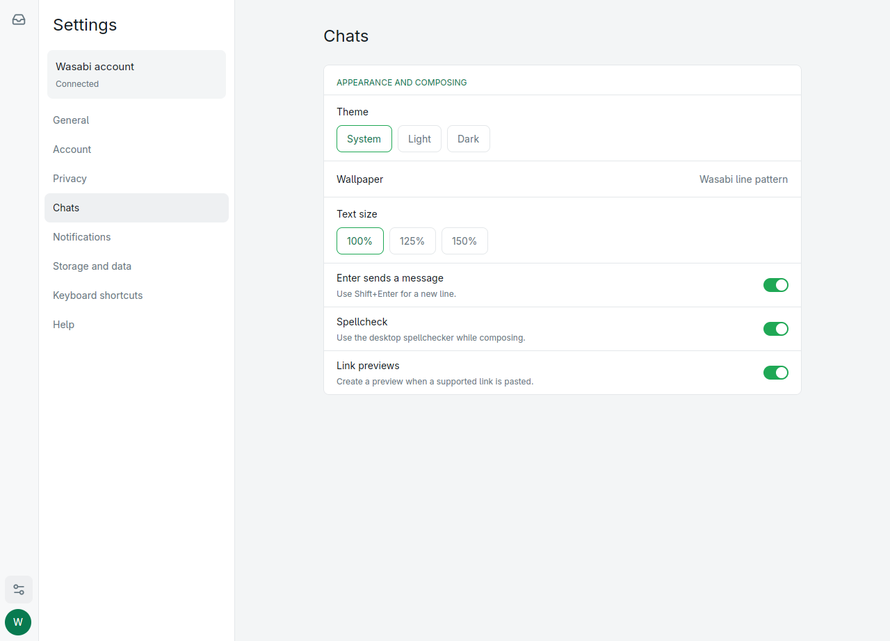
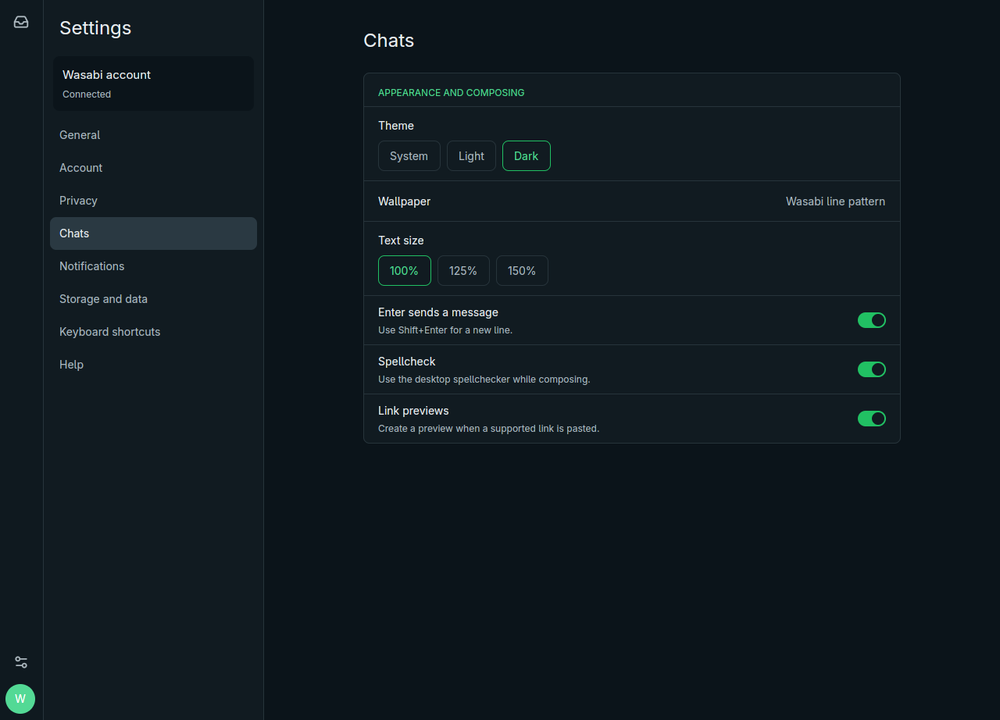

# Wasabi

**Current release: 0.2.0-alpha.1 — developer preview**

Wasabi is a fast, native Linux desktop messenger for WhatsApp accounts. It is built in Rust with GPUI and is designed to feel at home on the desktop without shipping an Electron runtime.

> **Developer preview:** Wasabi already supports pairing, cached conversations, message history, chat filtering, text messaging, responsive contact information, and persistent desktop settings. Media, notifications, full message actions, and several account-management workflows are still being completed before the first stable release.

## A focused Linux messenger

Wasabi is being built around a few straightforward principles:

- **Native and efficient.** A Rust and GPUI application instead of a bundled browser runtime.
- **Useful offline.** Cached chats and history appear immediately while the account reconnects.
- **Honest interfaces.** Wasabi does not invent contacts, participants, media, or unavailable features.
- **Familiar interaction.** The layout follows the current WhatsApp desktop information architecture while using original Wasabi branding and visuals.
- **Private by default.** Message bodies, phone numbers, pairing secrets, and media keys are excluded from normal logs.

## Screenshots

### Chats


### Settings



### Dark theme



### Responsive contact information

At the minimum supported window size, contact and group information opens over the conversation and can be dismissed with `Escape`.


### Group information

When connected, group information is loaded on demand and uses real server metadata for the subject, description, participant count, identities, and admin roles.


More verified captures are available in [`docs/screenshots`](docs/screenshots/README.md).

## What works today

- Link an account using a rotating QR code.
- Reopen cached chats immediately while reconnecting in the background.
- Browse cursor-paginated active chats using All, Unread, Favorites, and Groups filters, with a separate Archived destination.
- Search loaded chats and the complete local message FTS index with cancellable, paginated results.
- Read paginated message history and send text messages.
- Use light, dark, or Linux system appearance.
- Configure text size, Enter-to-send, spellcheck, link previews, notifications, download location, and cache quota.
- Persist device settings independently from the linked account.
- Enable standards-based XDG autostart.
- Open direct-contact information without incorrect participant rows.
- When connected, load group subject, description, participant count, identities, and admin roles without fabricated rows.

## Native footprint

On the current Linux reference machine, five fresh-profile launches of Wasabi `0.2.0-alpha.1` opened the window in a mean 131.6 ms and settled at 230.0 MiB proportional set size (PSS). A blank Electron 41 window on the same machine took 423.8 ms and settled at 326.8 MiB PSS. Wasabi used one process versus Electron's six.

This is a reproducible runtime-baseline comparison, not a fabricated measurement of the official WhatsApp app. There is no official Linux desktop binary to measure locally, and Meta's current Windows and Mac apps should not be described as the old Electron client. Read the complete methodology, raw results, package-size context, limitations, and rerun instructions in [`benchmarks/desktop`](benchmarks/desktop/README.md).

## Before the stable release

The stable release is gated on reliable media attachments and downloads, complete search and message actions, real contact/group metadata refresh, desktop notifications, phone-number pairing, account controls, recovery tests, and performance validation on large histories.

Calls, Status, Channels, and Communities remain hidden until their complete workflows are ready. Wasabi does not ship placeholder destinations.

## Run Wasabi from source

Wasabi currently targets Linux/X11. The repository pins the Rust toolchain it expects.

```bash
git clone https://github.com/salman0ansari/wasabi.git
cd wasabi
cargo run --manifest-path apps/desktop/Cargo.toml
```

GPUI requires the standard Linux X11, font, graphics, and audio development libraries supplied by your distribution. Wayland, Windows, and macOS portability is planned, but those platforms do not currently block the Linux release.

Wasabi stores account data under the platform data directory (normally `~/.local/share/wasabi`) and device preferences in `~/.config/wasabi/settings.json`.

## Development checks

The headless workspace and native desktop workspace are intentionally isolated:

```bash
cargo test --workspace --all-targets
cargo test --manifest-path apps/desktop/Cargo.toml --all-targets
cargo check --manifest-path apps/desktop/Cargo.toml --all-targets
./scripts/check-release-metadata.sh
```

## Versioning and releases

Wasabi follows [Semantic Versioning](https://semver.org/). Until 1.0, minor releases may make breaking changes while patch releases remain compatible within that minor line. Preview builds use explicit identifiers such as `alpha`, `beta`, and `rc`.

The repository's [`VERSION`](VERSION) file is the release source of truth. See the [`CHANGELOG`](CHANGELOG.md) for product changes and [`docs/RELEASING.md`](docs/RELEASING.md) for the release process.

Contributions are welcome; start with [`CONTRIBUTING.md`](CONTRIBUTING.md). Please report security-sensitive issues using the private process in [`SECURITY.md`](SECURITY.md), not a public issue.

## Unofficial client notice

Wasabi is an independent project and is not affiliated with, endorsed by, or sponsored by WhatsApp or Meta. WhatsApp is a trademark of its respective owner.
