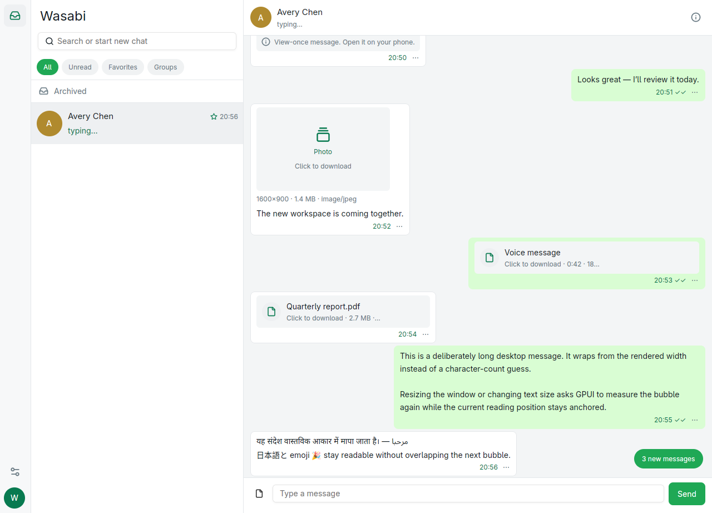
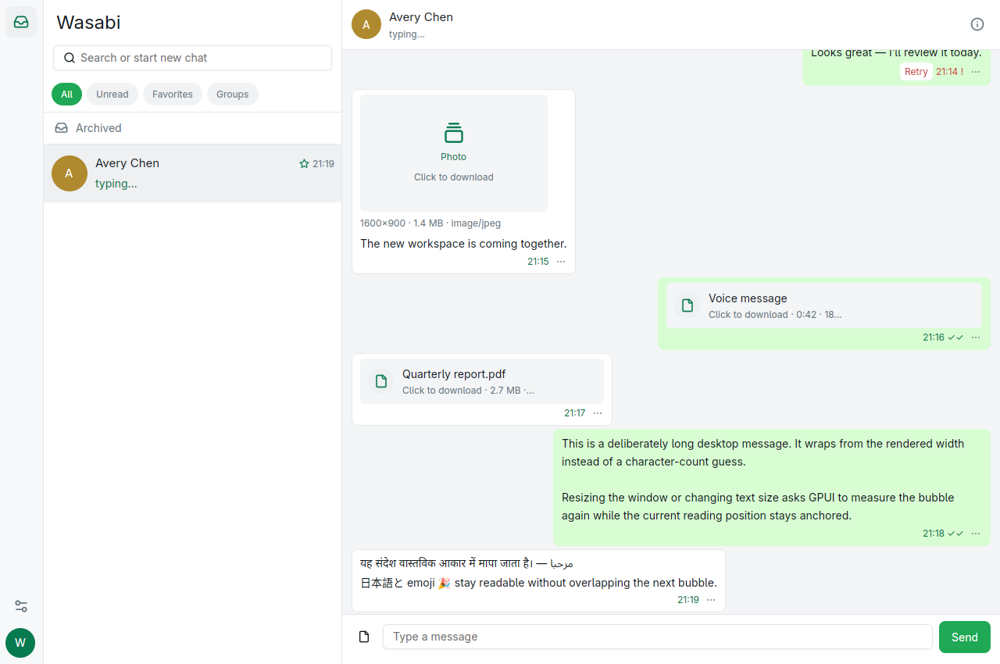
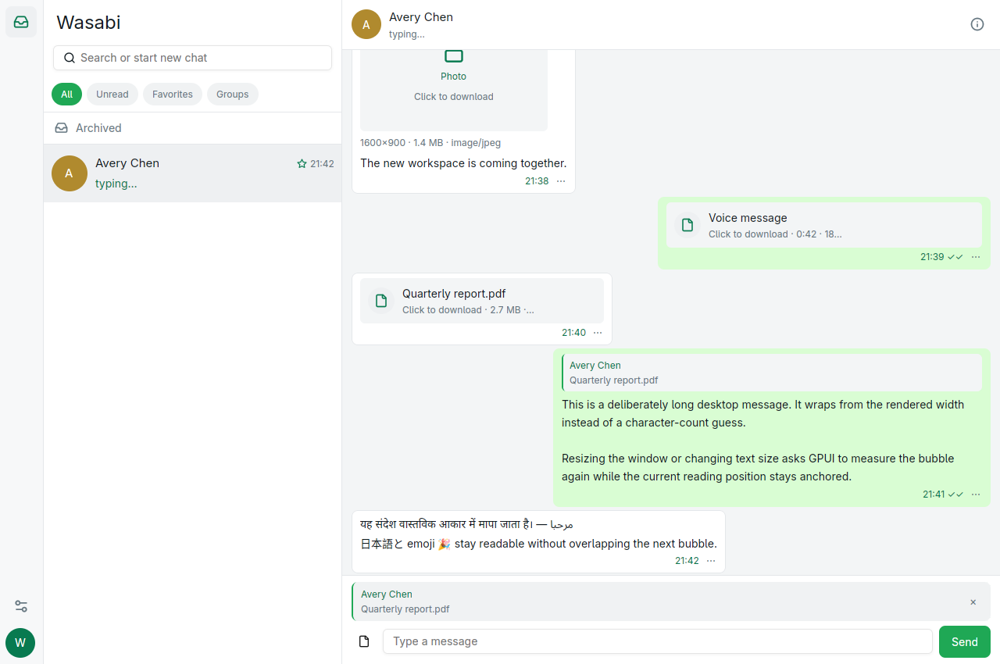
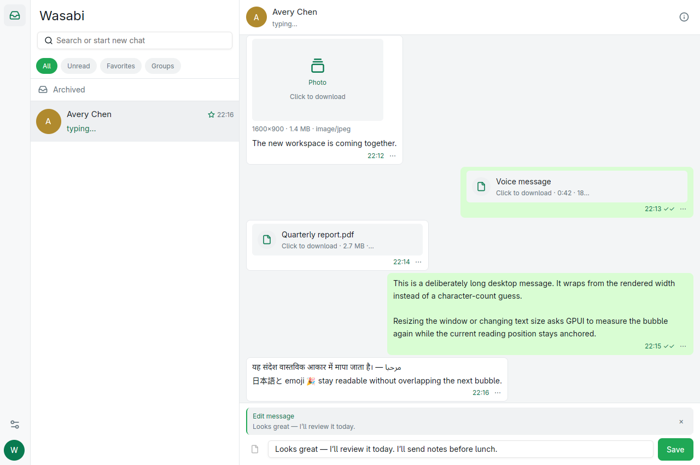
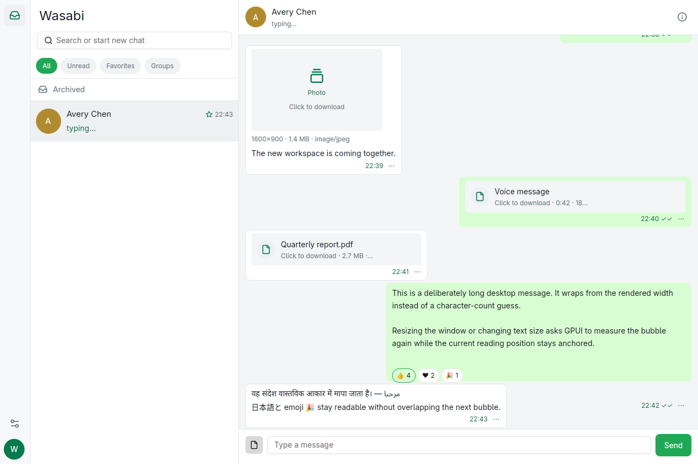
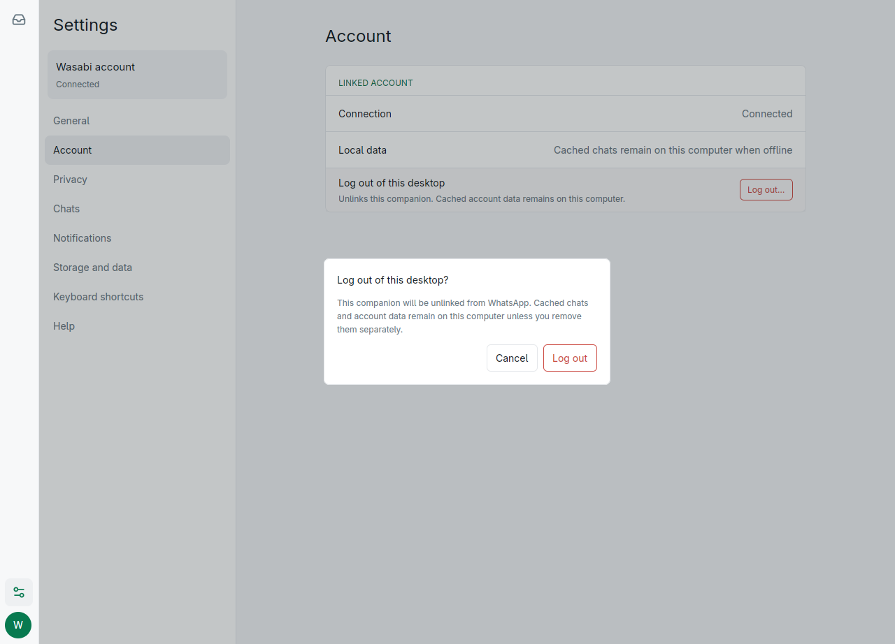

# Wasabi

**Current release: 0.2.0-alpha.1 — developer preview**

Wasabi is a fast, native Linux desktop messenger for WhatsApp accounts. It is built in Rust with GPUI and is designed to feel at home on the desktop without shipping an Electron runtime.

> **Developer preview:** Wasabi already supports pairing, cached conversations, message history, chat filtering, text and media messaging, responsive contact/group information, privacy-aware Linux notifications, message actions, and persistent desktop settings. Live-account media interoperability, deeper account management, and recovery hardening are still being completed before the first stable release.

## A focused Linux messenger

Wasabi is being built around a few straightforward principles:

- **Native and efficient.** A Rust and GPUI application instead of a bundled browser runtime.
- **Useful offline.** Cached chats and history appear immediately while the account reconnects.
- **Honest interfaces.** Wasabi does not invent contacts, participants, media, or unavailable features.
- **Familiar interaction.** The layout follows the current WhatsApp desktop information architecture while using original Wasabi branding and visuals.
- **Private by default.** Message bodies, phone numbers, pairing secrets, and media keys are excluded from normal logs.

## Screenshots

### Chats

Message bubbles use GPUI's measured variable-height list. Long paragraphs,
explicit newlines, multilingual text, emoji, media cards, window resizing, and
150% text scaling reflow from their rendered size without overlapping.


Incoming messages never evict or jump the history currently being read. A
compact affordance lets the user move to the newest anchored page explicitly.



Failed outgoing messages remain visible and can be retried safely. Wasabi
republishes the durable stored payload under its original message ID so an
ambiguous earlier attempt cannot turn into a duplicate.



Replies are real protocol replies, not visual-only decorations. Reply context
is restored with each per-chat draft, works for text and attachments, and a
quoted card navigates back to the original message even when Wasabi must load
an anchored history window first.



Acknowledged outgoing text can be edited inside the protocol window. Edit
mode is per-chat and restart-safe, refuses to overwrite another draft or
attachment, and rolls the optimistic bubble back if synchronization fails.



Reaction chips come from the durable per-sender aggregate, show real counts,
highlight the linked account's own choice, and can be clicked to replace or
remove that reaction without creating standalone reaction bubbles.



### Attachments

Selected files are copied into restart-safe Wasabi staging before upload. The composer shows the real filename, media class, and size without exposing local paths.


### Settings

Settings are persistent and operational: the Storage surface reports live
cache use, enforces the selected quota, opens the Linux folder picker, and
requires confirmation before clearing downloaded media.


Logging out unlinks only this desktop and explicitly preserves cached local
account data unless the user chooses a separate removal flow.



### Dark theme


### Responsive contact information

At the minimum supported window size, contact and group information opens over the conversation and can be dismissed with `Escape`.


### Group information

When connected, group information is loaded on demand and uses real server metadata for the subject, description, participant count, identities, and admin roles.


More verified captures are available in [`docs/screenshots`](docs/screenshots/README.md).

## What works today

- Link an account using a rotating QR code or a short-lived phone-number code.
- Reopen cached chats immediately while reconnecting in the background.
- Browse cursor-paginated active chats using All, Unread, device-local Favorites, and Groups filters, with a separate Archived destination.
- Search loaded chats and the complete local message FTS index with cancellable, paginated results that open the exact message in context.
- Read paginated message history and send text, image, video, audio, and document messages with optional supported captions.
- Read actually measured multiline and multilingual bubbles that reflow across supported window sizes and text scaling without overlap.
- Keep the current history anchor when older pages prepend or new messages arrive, with an explicit jump-to-newest affordance.
- Retry failed outgoing messages from the bubble or message-action menu without creating a second message identity.
- Restore composer text when a send fails before durable acceptance; committed failures remain represented by their retryable bubble.
- Reply to text or media with restart-safe per-chat context, render received quotes, and navigate quoted cards to their original messages.
- Edit acknowledged outgoing text inside the protocol window with a chat-bound, restart-safe composer and failure rollback.
- Stage outgoing files durably, recover interrupted composer attachments after restart, cancel them safely, and stream encryption/upload without buffering entire files in memory.
- Download received media on demand into a bounded, content-addressed, SHA-256-verified cache.
- Copy and react to messages, see durable reaction counts, replace/remove your own choice, or star/unstar with optimistic rollback if synchronization fails.
- Delete a message locally or revoke an eligible sent message through distinct, explicit confirmation dialogs.
- Pin/unpin and mute/unmute chats from the conversation drawer.
- Mark unread conversations read when they are opened in the active window, without cross-chat races.
- Keep independent per-chat text drafts across conversation switches and app restarts.
- Use light, dark, or Linux system appearance.
- Configure text size, Enter-to-send, notifications, download location, and an actively enforced media-cache quota.
- Inspect current media-cache usage and clear downloaded media through an explicit confirmation flow.
- Log out of the linked companion through a confirmation that distinguishes unlinking from local-data removal.
- Receive standard Linux desktop notifications that respect mute, focus, sound, and preview-privacy settings; clicking one focuses its conversation.
- Persist device settings independently from the linked account.
- Enable standards-based XDG autostart.
- Open direct-contact information without incorrect participant rows.
- When connected, load group subject, description, participant count, identities, and admin roles without fabricated rows.

## Native footprint

On the current Linux reference machine, five fresh-profile launches of Wasabi `0.2.0-alpha.1` had a 132 ms startup median and settled at 237.2 MiB proportional set size (PSS). A blank Electron 41 window had a 536 ms median and settled at 334.5 MiB PSS. Wasabi used one process versus Electron's six. A retained 3,776 ms first Wasabi launch raised its mean to 860.8 ms versus Electron's 685.0 ms; all four subsequent Wasabi samples were 130–135 ms. Every raw sample is committed.

This is a reproducible runtime-baseline comparison, not a fabricated measurement of the official WhatsApp app. There is no official Linux desktop binary to measure locally, and Meta's current Windows and Mac apps should not be described as the old Electron client. Read the complete methodology, raw results, package-size context, limitations, and rerun instructions in [`benchmarks/desktop`](benchmarks/desktop/README.md).

## Before the stable release

The stable release is gated on live-account media interoperability testing, durable contact/group metadata refresh, remaining account controls, expanded recovery/interaction tests, and performance validation on large synchronized histories.

Calls, Status, Channels, and Communities remain hidden until their complete workflows are ready. Wasabi does not ship placeholder destinations.

## Run Wasabi from source

Wasabi currently targets Linux/X11. The repository pins the Rust toolchain it expects.

```bash
git clone https://github.com/salman0ansari/wasabi.git
cd wasabi
cargo run --manifest-path apps/desktop/Cargo.toml
```

GPUI requires the standard Linux X11, font, graphics, and audio development libraries supplied by your distribution. Wayland, Windows, and macOS portability is planned, but those platforms do not currently block the Linux release.

Wasabi stores account data under the platform data directory (normally `~/.local/share/wasabi`) and device preferences in `~/.config/wasabi/settings.json`.

## Development checks

The headless workspace and native desktop workspace are intentionally isolated:

```bash
cargo test --workspace --all-targets
cargo test --manifest-path apps/desktop/Cargo.toml --all-targets
cargo check --manifest-path apps/desktop/Cargo.toml --all-targets
./scripts/check-release-metadata.sh
```

## Versioning and releases

Wasabi follows [Semantic Versioning](https://semver.org/). Until 1.0, minor releases may make breaking changes while patch releases remain compatible within that minor line. Preview builds use explicit identifiers such as `alpha`, `beta`, and `rc`.

The repository's [`VERSION`](VERSION) file is the release source of truth. See the [`CHANGELOG`](CHANGELOG.md) for product changes and [`docs/RELEASING.md`](docs/RELEASING.md) for the release process.

Contributions are welcome; start with [`CONTRIBUTING.md`](CONTRIBUTING.md). Please report security-sensitive issues using the private process in [`SECURITY.md`](SECURITY.md), not a public issue.

## Unofficial client notice

Wasabi is an independent project and is not affiliated with, endorsed by, or sponsored by WhatsApp or Meta. WhatsApp is a trademark of its respective owner.
